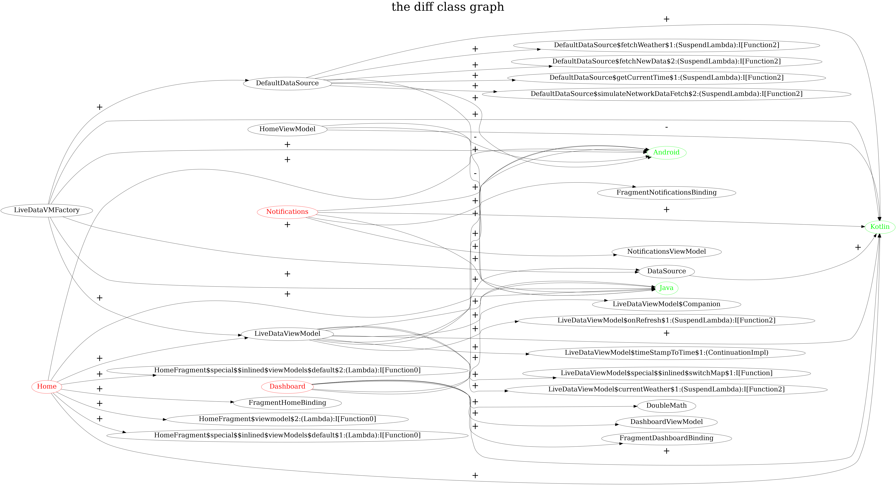

## Readme

> A funny android plugin and related workflow help us visualize the class diff graph from pull request and two commits.

Here is the result



### How it work

* We use git to output the diff file list.

```
git diff --name-only "$before_commit" "$current_commit" | grep '[.kt|.java]$' > $diff_file
```

The result looks like this list

```
app/src/main/java/com/android/nativationsample/ui/dashboard/DashboardFragment.kt
app/src/main/java/com/android/nativationsample/ui/home/DefaultDataSource.kt
app/src/main/java/com/android/nativationsample/ui/home/HomeFragment.kt
app/src/main/java/com/android/nativationsample/ui/home/LiveDataViewModel.kt
app/src/main/java/com/android/nativationsample/ui/notifications/NotificationsFragment.kt
plugin/src/main/kotlin/jack/android/plugin/classdiff/dot/DotGenerator.kt
plugin/src/main/kotlin/jack/android/plugin/classdiff/task/OutputClassGraphDotTask.kt
plugin/src/main/kotlin/jack/android/plugin/classdiff/transform/ClassGraphBuildTransform.kt
```

We need to output all the class references by compare with the sourceSets

```
val appExtension: BaseExtension = project.extensions.getByType(AppExtension::class.java);
appExtension.sourceSets.forEach { sourceSet ->
    if (sourceSet.name != "test" && sourceSet.name != "androidTest") {
        sourceSetFiles.addAll(sourceSet.java.srcDirs)
    }
}
```

Now we get all the changed classes.

```
com.android.nativationsample.ui.dashboard.DashboardFragment
com.android.nativationsample.ui.home.DefaultDataSource
com.android.nativationsample.ui.home.HomeFragment
com.android.nativationsample.ui.home.LiveDataViewModel
com.android.nativationsample.ui.notifications.NotificationsFragment
```

Build our class graph by using the Gradle transform

```
./gradlew -Pdiff_file=$diff_file :app:transformClassesWithClassGraphBuildForDebug
```

Then, we use json to store all the changed class information. The class information contains all the
fields and methods.

```
{
    "interfaces": [
      "androidx.lifecycle.ViewModelProvider$Factory"
    ],
    "methods": {
      "create": [
        "com.android.nativationsample.ui.home.LiveDataViewModel",
        "androidx.lifecycle.ViewModel",
        "java.lang.Class",
        "kotlin.jvm.internal.Intrinsics",
        "com.android.nativationsample.ui.home.DataSource"
      ],
      "<init>": [
        "java.lang.Object"
      ],
      "<clinit>": [
        "com.android.nativationsample.ui.home.DefaultDataSource",
        "kotlinx.coroutines.Dispatchers"
      ]
    },
    "name": "com.android.nativationsample.ui.home.LiveDataVMFactory",
    "fields": [
      "com.android.nativationsample.ui.home.DefaultDataSource",
      "com.android.nativationsample.ui.home.LiveDataVMFactory"
    ],
    "innerClasses": []
}
```

We compare the two records and use the generate the dot file by executing `outputClassGraphDotTask`

```
./gradlew --stacktrace\
    "-Pclass_change_title=$dot_file_title" \
    "-Poutput_dot_file=$output_dot_file" \
    "-Pdiff_class_file=$diff_file" \
    "-Pprevious_diff_file=$class_references_before" \
    "-Pcurrent_diff_file=$class_references_after" \
    :app:outputClassGraphDotTask
```

Finally, use `graphviz` convert the dot file to png.

Here is a Github actions [workflow](.github/workflows/pull-request-class-diff.yml) to combine it
together.